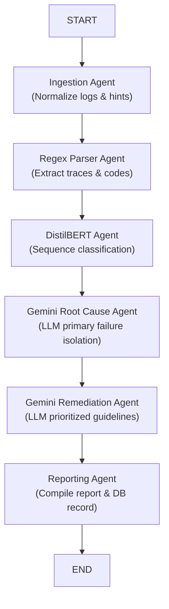

# ⚡ AI-Powered CI/CD Log Analyzer Dashboard

An advanced, multi-agent AI intelligence platform designed to ingest CI/CD pipeline logs, dissect complex failure streams, isolate original root causes (filtering out cascading errors), and compile high-priority, step-by-step remediation fixes.

---

## 🚀 Key Features

* **Multi-Agent Diagnostics (LangGraph)**: Sequential pipeline executing structured ingestion, regex parsing, machine learning classification, LLM root cause analysis, and remediation generation.
* **Regex Parser Agent**: Safely normalizes character encodings, extracts timestamps, retrieves exit status codes, identifies Python/Java/Node stack traces, and segments execution stages.
* **DistilBERT Sequence Classifier Agent**: Predicts failure categories (Dependency, Test, Docker, Compilation, Environment, Infrastructure, etc.) using a PyTorch classification head with zero-shot rule fallbacks.
* **Gemini Root Cause Agent**: Analyzes error segments using Google Gemini to identify the fundamental primary bug and flag exact trace evidence lines.
* **Gemini Remediation Agent**: Formulates step-by-step resolution fixes grouped by priority (High, Medium, Low).
* **🐙 GitHub Actions Integration**: Connect seamlessly via GitHub OAuth or a Personal Access Token (PAT) directly in the dashboard to choose a repository, browse recent workflow execution runs, and run live diagnostics.
* **Premium Glassmorphic Dashboard**: Beautiful, responsive, edge-lit dark-mode UI with circular confidence meters, collapsible trace drawers, action guidelines, and a SQLite-connected **History Vault** to search, load, or delete past diagnostics.

---

## 🛠️ Architecture

The pipeline uses LangGraph to coordinate the sequential flow of state data across the AI agents:



---

## 💻 Tech Stack

* **Backend**: FastAPI, LangGraph, Pydantic, PyTorch, Hugging Face Transformers, SQLite3.
* **Frontend**: HTML5, Vanilla CSS3 (Custom Glassmorphism), JavaScript (Vanilla ES6).
* **Cloud & Deployments**: Docker, Vercel SPA (Static Frontend), Render / Google Cloud Run (Containerized Backend).

---

## 🏁 Quick Start & Setup

### 1. Prerequisites
Ensure you have Python 3.10+ installed on your system.

### 2. Clone the Repository & Install Dependencies
```bash
git clone https://github.com/Deekshith149/ci-cd-log-analyzer.git
cd ci-cd-log-analyzer

# Initialize virtual environment (optional but recommended)
python -m venv .venv
source .venv/bin/activate  # On Windows: .venv\Scripts\activate

# Install requirements
pip install -r requirements.txt
```

### 3. Environment Configuration
Create a `.env` file in the root directory (based on our sample setup):
```env
# Google AI Studio Gemini API Key
GEMINI_API_KEY=your_gemini_api_key_here

# (Optional) GitHub Integration OAuth keys
# Leave blank to connect instantly using Personal Access Tokens (PATs) in the UI
GITHUB_CLIENT_ID=
GITHUB_CLIENT_SECRET=
GITHUB_REDIRECT_URI=http://localhost:8000/api/v1/auth/github/callback
```

### 4. Initialize Database and Run Server
```bash
python -m src.main
```
The application will launch on **[http://localhost:8000](http://localhost:8000)**.

---

## 🧪 Testing

Execute the test suites to verify backend endpoints, state graphs, regex patterns, and GitHub connectors:

```bash
# Run the complete test suite
python -m pytest

# Run only the GitHub Actions connector tests
python -m pytest src/tests/test_github.py
```

---

## 🐳 Cloud Deployment (Split-Architecture)

To maintain optimal package sizes for deep learning engines (`torch` & `transformers`), we use a modern split-architecture:

### 1. Backend (Render / Google Cloud Run / Docker)
The repository includes a ready-to-use [`Dockerfile`](./Dockerfile) for containerized hosting:
```bash
# Build the container
docker build -t ci-cd-log-analyzer .

# Run the container
docker run -d -p 8000:8000 --env-file .env ci-cd-log-analyzer
```
For Cloud Run, deploy directly from source:
```bash
gcloud run deploy ci-cd-log-analyzer --source . --port 8000 --allow-unauthenticated
```

### 2. Frontend (Vercel SPA edge hosting)
1. In [`src/static/app.js`](./src/static/app.js) line 7, replace the fallback URL placeholder with your deployed backend's production API domain.
2. Link your Git repository to Vercel.
3. Set Vercel's **Root Directory** project setting to **`src/static`**.
4. Click **Deploy**!
