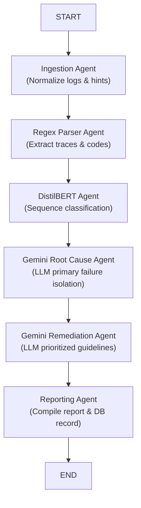

# ⚡ PipelineIQ — AI-Powered CI/CD Failure Intelligence

**PipelineIQ** is a production-grade, multi-agent AI platform that automatically analyzes CI/CD pipeline failures, identifies root causes using DistilBERT + Gemini, and delivers prioritized step-by-step remediation — in seconds, not hours.

> Stop guessing why deployments fail. Let AI diagnose it for you.

---

## 🚀 Key Features

- **Multi-Agent LangGraph Pipeline** — Sequential orchestration: Ingestion → Parsing → Classification → Root Cause → Remediation → Reporting.
- **DistilBERT Classifier** — ML-powered failure category prediction across 8+ types (Dependency, Test, Docker, Compilation, Environment, Infrastructure, etc.) with PyTorch classification head and zero-shot fallbacks.
- **Gemini Root Cause Agent** — Isolates the primary failure from cascading noise, pinpoints exact evidence lines.
- **Gemini Remediation Agent** — Generates High / Medium / Low priority step-by-step fix instructions.
- **GitHub Actions Integration** — Connect via OAuth or PAT to browse repositories, select workflow runs, and stream live CI/CD logs directly into the analysis engine.
- **Premium Next.js Landing Page** — Glassmorphic SaaS landing page with dark/light mode, animated counters, interactive demo, comparison table, contact-based pricing, and CTA.
- **History Vault** — SQLite-backed report storage with search, load, and delete across all past analyses.

---

## 🛠️ Architecture



---

## 💻 Tech Stack

| Layer | Technologies |
|---|---|
| **Backend** | FastAPI, LangGraph, Pydantic, PyTorch, Hugging Face Transformers, SQLite3 |
| **AI Models** | DistilBERT (classification), Google Gemini 1.5 Pro (RCA + remediation) |
| **Landing Page** | Next.js 16, Tailwind CSS v4, Framer Motion, next-themes |
| **Deployment** | Docker (backend), Vercel (landing page), Render / Google Cloud Run (API) |

---

## 🏁 Quick Start

### 1. Prerequisites
- Python 3.10+
- Node.js 18+ (for landing page)

### 2. Clone & Install
```bash
git clone https://github.com/Deekshith149/pipelineiq.git
cd pipelineiq

# Backend dependencies
python -m venv .venv
source .venv/bin/activate  # Windows: .venv\Scripts\activate
pip install -r requirements.txt

# Landing page dependencies
cd landing && npm install && cd ..
```

### 3. Environment Configuration
Create a `.env` file in the root directory:
```env
# Google AI Studio — Gemini API Key
GEMINI_API_KEY=your_gemini_api_key_here

# GitHub OAuth (optional — use PAT in UI instead)
GITHUB_CLIENT_ID=
GITHUB_CLIENT_SECRET=
GITHUB_REDIRECT_URI=http://localhost:8000/api/v1/auth/github/callback
```

### 4. Run the Backend
```bash
python -m src.main
```
API launches on **[http://localhost:8000](http://localhost:8000)**

### 5. Run the Landing Page (dev)
```bash
cd landing
npm run dev
```
Landing page at **[http://localhost:3000](http://localhost:3000)**

---

## 🧪 Testing

```bash
# Full test suite
python -m pytest

# GitHub connector tests only
python -m pytest src/tests/test_github.py
```

---

## 🐳 Deployment

### Backend — Docker / Cloud Run
```bash
# Build and run locally
docker build -t pipelineiq .
docker run -d -p 8000:8000 --env-file .env pipelineiq

# Google Cloud Run
gcloud run deploy pipelineiq --source . --port 8000 --allow-unauthenticated
```

### Landing Page — Vercel
1. Connect the `pipelineiq` GitHub repository to [Vercel](https://vercel.com)
2. Set **Root Directory** to `landing`
3. Framework: **Next.js** (auto-detected)
4. Click **Deploy** — auto-deploys on every push to `main`

---

## 📁 Project Structure

```
pipelineiq/
├── landing/                 # Next.js SaaS landing page
│   └── src/
│       ├── app/             # Next.js App Router (layout, page, globals.css)
│       └── components/      # Hero, Features, Workflow, Demo, Metrics, Pricing...
├── src/                     # Python FastAPI backend
│   ├── agents/              # LangGraph AI agents
│   ├── api/                 # FastAPI routes
│   ├── classifier/          # DistilBERT classifier
│   └── static/              # Legacy static frontend
├── Dockerfile
├── requirements.txt
└── vercel.json
```

---

## 📄 License

MIT © 2026 PipelineIQ
